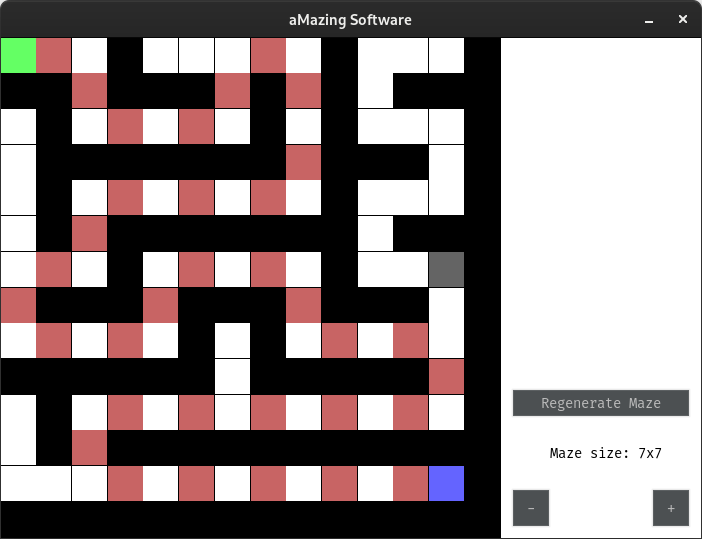
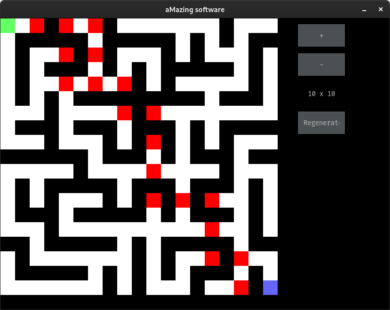
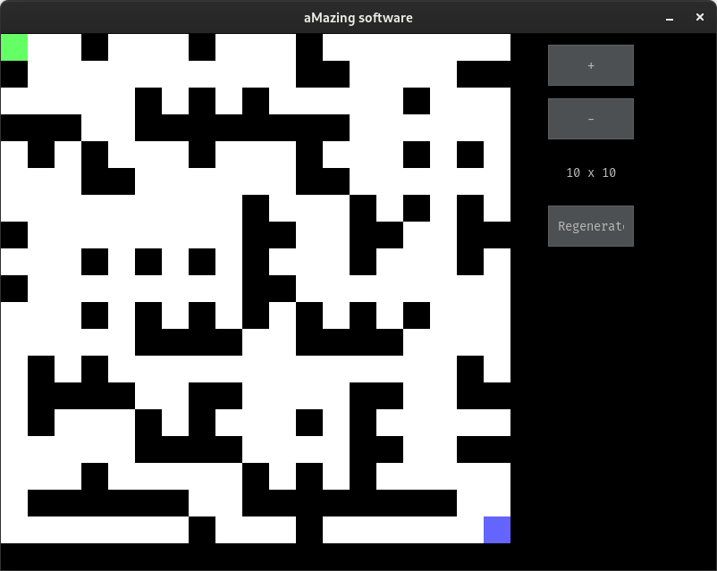
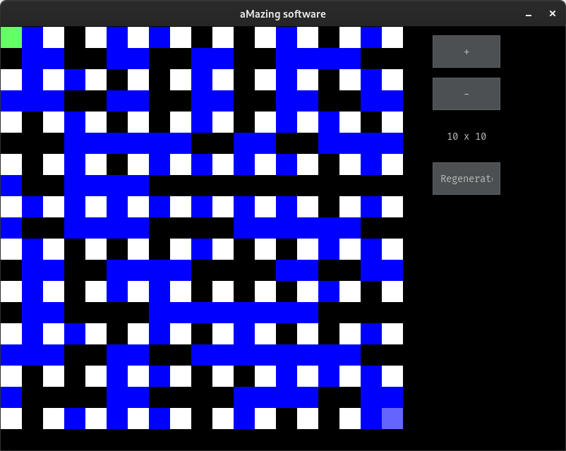
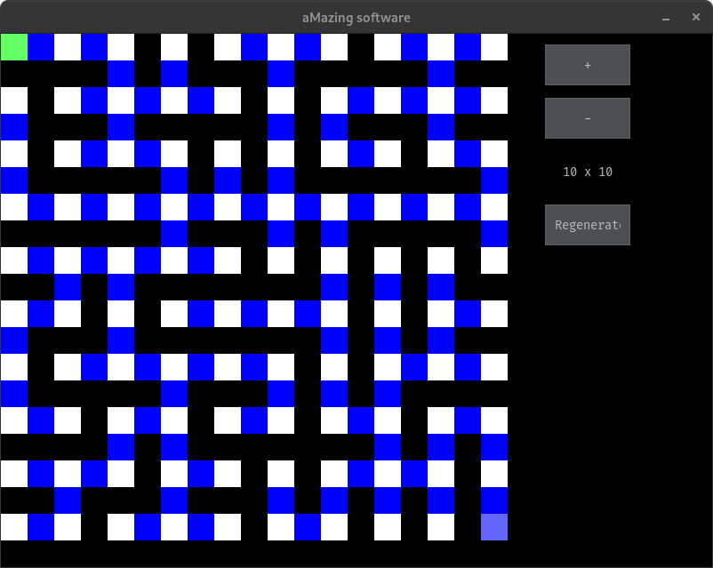
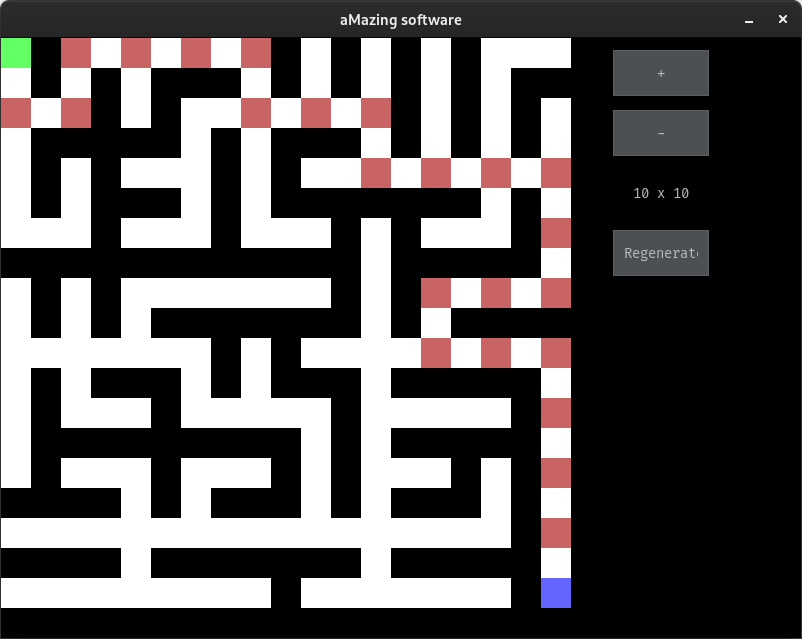
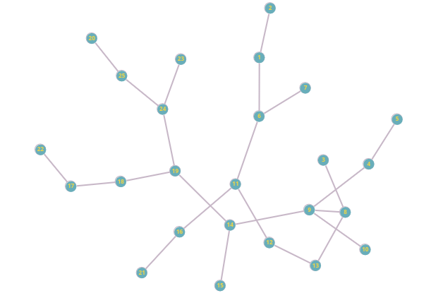
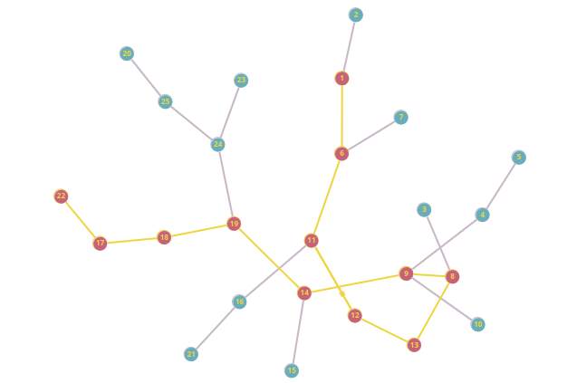
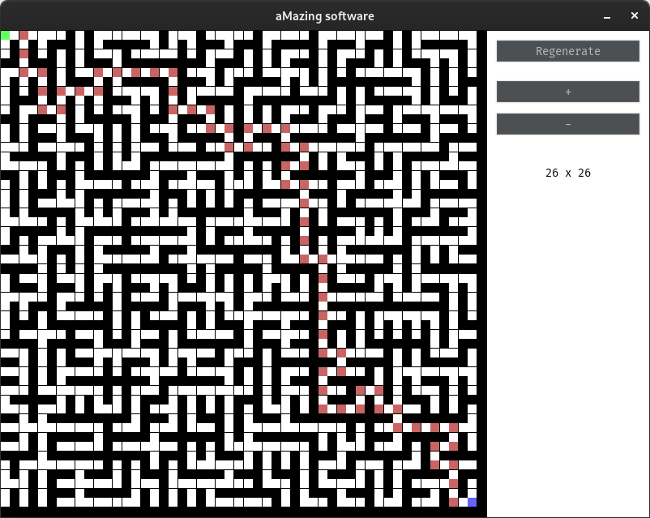

# Assessment Task 3 - 3

This totally didn't take, overall for both attempts, a total of 19 hours over the past week...

This is actually the second iteration of part 3, the original one can be found [here](https://github.com/lochyj/School-Projects/tree/b1582f62afe2f4f750f3ac5ae7a7be0832a7e219/Data%20Science/AT3-3)*

\* It is an old commit as the newer versions don't work. This is the commit I used to display what my dfs generation algorithm looked like.

If you want to view the nicely rendered version of this readme visit [here](https://github.com/lochyj/School-Projects/tree/main/Data%20Science/AT3-3v2)

## Themes

The themes.json file is there to change the text colour of the UI_Label so you can see it better.

## The little grey square

What is the grey square?
Well, the square shown below is a cursor of sorts that I have added to help visualise the separation of the vertices of the graph from the edges, as that is how the maze is generated, through a graph.

||
|-|

## Artifacting in the maze drawing

There are artifacts occurring when the maze is being drawn (little gaps in the maze every so often), I'm sure I could fix this as it is being caused by the cell_size variable, however, it makes the maze look nice and even when its being drawn so I'm going to leave it how it is.

||
|-|

## Performance issues

There is some performance issues with prims algorithm, this is, after no investigation, caused by the expansion of the edges list further into the generation of the maze. This slow down of the prims main loop is visible in the console for larger graphs where, at the end of each iteration we print the current iteration. This starts to become a problem at a maze size of ~20x20.

## Design choices

### Why did I go with prims algorithm?

In my first iteration I initially went with DFS, which if im being honest didn't look great as you can see below.

So I had a look at the maze generation wikipedia page and saw [this](https://en.wikipedia.org/wiki/File:MAZE_30x20_Prim.ogv) video and decided I was going to generate the maze with prims algorithm.

DFS generation:
||
|-|

### Why did I choose djikstras to solve the maze?

I choose djikstras mainly because it had good pseudo code on wikipedia for it that also outlined how to find the shortest path, using reverse iteration.

## Some interesting errors and iterations

A cheating path. (This was due to an issue with drawing the edges on the graph and as such, this path is valid, however, you need to reflect the graph along the x axis from the middle of the graph for it to fit the path)
||
|-|

Edge drawing is broken
||
|-|

Slightly less broken edge drawing
||
|-|

Fixed the edge drawing issues
||
|-|

Maze drawing is finished
||
|-|

The first output of my prims maze generation algorithm, displayed on https://graphonline.ru/en/#
||
|-|

The first output of my djikstras implementation of the above graph, displayed on https://graphonline.ru/en/#
||
|-|

The final product
||
|-|
